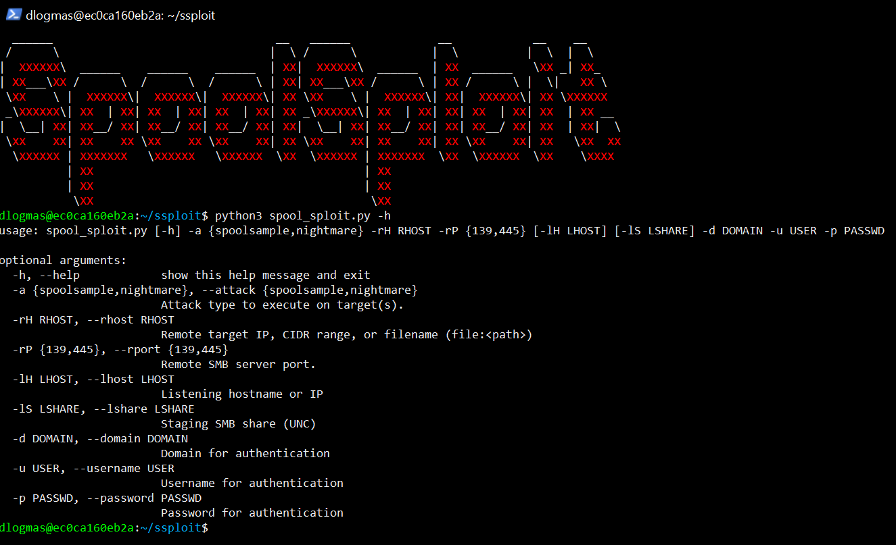
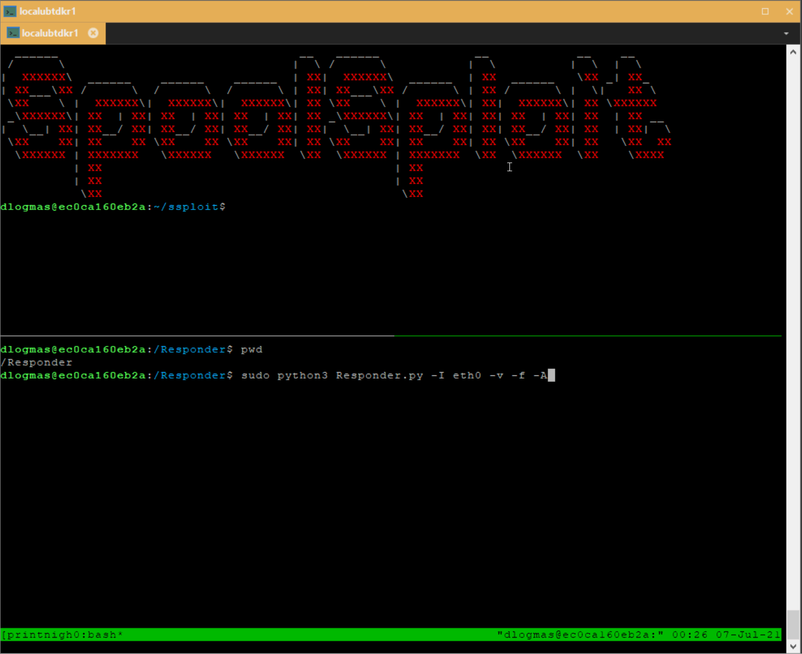
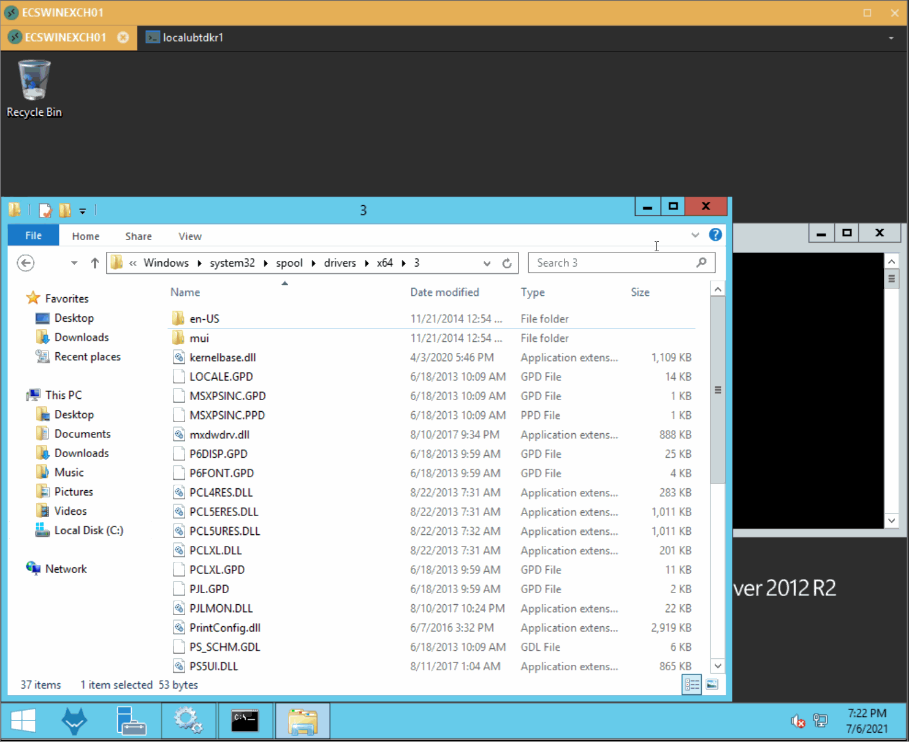

# SpoolSploit
A collection of Windows print spooler exploits containerized with other utilities for practical exploitation.

## Summary
SpoolSploit is a collection of Windows print spooler exploits containerized with other utilities for practical exploitation. A couple of highly effective methods would be relaying machine account credentials to escalate privileges and execute malicious DLLs on endpoints with full system access.



## Getting Started
As of the release date the SpoolSploit Docker container has been tested successfully on the latest versions of ```MacOS```, ```Ubuntu Linux```, and ```Windows 10```.

Although not required, if you would like to host malicious DLLs or conduct credential relay attacks, all within the SpoolSploit container, you should ensure port 445 is not in use on the host running Docker. This is most prevalent when running this container on a Windows host, as it uses port 445 by default. If disabling port 445 on your host is not practical, that is okay! You can simply run the docker container in a virtual machine that has the network adapter configured in bridge mode. This will allow for serving malicious DLLs and relay credentials. If you only want to serve malicious DLLs, you could simply host the DLLs on an anonymous access share on your host OS or a compromised server share.

### Create and access the SpoolSploit Docker container
1. Clone this repository
```
git clone https://github.com/BeetleChunks/SpoolSploit
```
2. Build the SpoolSploit Docker container image
```
cd SpoolSploit
sudo docker build -t spoolsploit .
```
3. Create and start the SpoolSploit Docker container
```
sudo docker run -dit -p 445:445 --name spoolsploit spoolsploit:latest
```
4. Attach to the container
```
sudo docker exec -it spoolsploit /bin/bash
```

### Command-line Usage
```
usage: spool_sploit.py [-h] -a {spoolsample,nightmare} -rH RHOST -rP {139,445} [-lH LHOST] [-lS LSHARE] -d DOMAIN -u USER -p PASSWD

optional arguments:
  -h, --help            show this help message and exit
  -a {spoolsample,nightmare}, --attack {spoolsample,nightmare}
                        Attack type to execute on target(s).
  -rH RHOST, --rhost RHOST
                        Remote target IP, CIDR range, or filename (file:<path>)
  -rP {139,445}, --rport {139,445}
                        Remote SMB server port.
  -lH LHOST, --lhost LHOST
                        Listening hostname or IP
  -lS LSHARE, --lshare LSHARE
                        Staging SMB share (UNC)
  -d DOMAIN, --domain DOMAIN
                        Domain for authentication
  -u USER, --username USER
                        Username for authentication
  -p PASSWD, --password PASSWD
                        Password for authentication
```

### SpoolSample - Capture and relay Windows machine account credentials
The SpoolSploit Docker container includes [Responder](https://github.com/lgandx/Responder) for relaying machine account hashes obtained from executing the ```spoolsample``` attack in SpoolSploit. As several great articles exist detailing the process of relaying privileged machine account credentials for privilege escalation, I will not go into those details here.

<p align="center">
  
</p>

### PrintNightmare (CVE-2021-1675) - Execute malicious DLLs on Windows targets as SYSTEM
Included in the SpoolSploit container is an SMB server implemented via [Impacket](https://github.com/SecureAuthCorp/impacket). This server can be used to host malicious DLLs when executing the ```printnightmare``` attack in SpoolSploit. The default SMB server settings work, but if you want to customize them you can modify the configuration file located at ```/home/dlogmas/smbserver/smb-v1.conf```.

The only thing you need to do is copy your DLL to the SMB server's share folder in the SpoolSploit container. The share path in the container is ```/home/dlogmas/smbserver/share/```. The following commands demonstrate how to upload a DLL to the SpoolSploit container and make it accessible to the SMB server.

```
sudo docker cp ./malicious.dll spoolsploit:/home/dlogmas/smbserver/share/
sudo docker exec spoolsploit /bin/sh -c 'sudo chown dlogmas:dlogmas /home/dlogmas/smbserver/share/malicious.dll'
```

<p align="center">
  
</p>

# Disclaimer
This proof-of-concept code has been created for academic research and is not intended to be used against systems except where explicitly authorized. The code is provided as is with no guarantees or promises on its execution. I am not responsible or liable for misuse of this code.

# Credits
## SpoolSample - Microsoft Feature
- [leechristensen](https://github.com/leechristensen/SpoolSample) discovered the SpoolSample exploit and created a C# POC [SpoolSample](https://github.com/leechristensen/SpoolSample/tree/master/SpoolSample)
- [3xocyte](https://gist.github.com/3xocyte) created a Python2 SpoolSample POC [dementor](https://gist.github.com/3xocyte/cfaf8a34f76569a8251bde65fe69dccc#file-dementor-py).

## PrintNightmare - CVE-2021-1675
- [cube0x0](https://github.com/cube0x0) created Python PrintNightmare exploit after implementing the MS-PAR & MS-RPRN protocols and API calls in [Impacket](https://github.com/SecureAuthCorp/impacket).
- [Zhiniang Peng](https://twitter.com/edwardzpeng) & [Xuefeng Li](https://twitter.com/lxf02942370) discovered this exploit.
